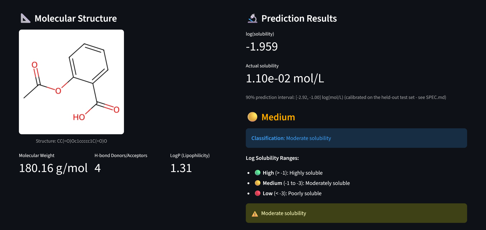

# Drug Solubility Prediction using Machine Learning
[](https://github.com/slastrzelec/drug-solubility-prediction/actions/workflows/tests.yml)

A machine learning project that predicts the aqueous solubility of drug molecules from their chemical structure, using Morgan fingerprints, RDKit physicochemical descriptors, and an XGBoost regressor, wrapped in an interactive Streamlit app.

See [SPEC.md](SPEC.md) for the spec this model-improvement pass was built against (feature engineering, feature selection, and the data-leakage guardrails it follows), and [train_v2.py](train_v2.py) for the actual training script.

## 🎯 Project Overview

**Problem:** given a drug's chemical structure (SMILES notation), predict its solubility in water — log(mol/L).

**Approach:**
1. Convert chemical structures to numerical features (Morgan fingerprints + physicochemical descriptors)
2. Select the most informative features, fit only on the training fold
3. Train and compare multiple ML models with `GridSearchCV`
4. Validate on a second, independent dataset (AqSolDB) before trusting the result
5. Ship the best model (XGBoost, test R² ≈ 0.91) behind a Streamlit UI

This property matters in pharmaceutical development because it directly affects a drug's bioavailability and dosing.

## 📊 Dataset

- **Source:** ESOL dataset (Delaney, 2004) — 1,144 drug compounds
- **Target:** log(solubility : mol/L), range -11.60 to 1.58
- **Split:** 80/20 (915 training / 229 test samples), `random_state=42`
- **External validation:** [AqSolDB](https://doi.org/10.1038/s41597-019-0151-1) (Sorkun et al., 2019), 8,881 compounds after removing the 1,099 that overlap with ESOL (ESOL is one of AqSolDB's nine source datasets)

## 🔬 Methodology

### Feature engineering

Each molecule is represented by a 2,048-bit Morgan fingerprint (radius=2) plus 7 RDKit physicochemical descriptors — molecular weight, LogP (Crippen), TPSA, H-bond donor/acceptor counts, rotatable bond count, and aromatic ring count (`features.py`).

```python
from features import featurize_mol
from rdkit import Chem

vector = featurize_mol(Chem.MolFromSmiles("CC(=O)Oc1ccccc1C(=O)O"))  # 2055-d vector
```

Features are standardized and reduced with `SelectFromModel` (median importance threshold on a Random Forest) — both fit **inside the training fold only**, as part of a single `sklearn.Pipeline`, so no information from the test set or from AqSolDB reaches the fitted scaler or selector. See [SPEC.md](SPEC.md) for why this matters.

### Model comparison

5-fold `GridSearchCV`, scored on the training set only:

| Model | CV R² |
|---|---|
| SVR | 0.732 |
| Random Forest | 0.852 |
| Gradient Boosting | 0.887 |
| **XGBoost** | **0.893** |

XGBoost was selected and refit on the full training set; the 229-row test set was then evaluated exactly once.

## 📈 Results

**Final model (XGBoost pipeline), test set (touched once):**

- **R² = 0.9116**, RMSE = 0.6203, MAE = 0.4824 log(mol/L)
- Train R² = 0.976 → train/test gap of 0.064, notably smaller than the previous fingerprint-only baseline's 0.24 — better generalization, not just a better fit

**External validation on AqSolDB** (8,881 compounds never seen during training or tuning):

- **R² = 0.638**, RMSE = 1.443, MAE = 0.988

The gap between the in-distribution test score (0.91) and the external score (0.64) is expected and is reported deliberately rather than blended into one number — it shows how much the model's accuracy depends on being close to the ESOL training distribution, which is the honest way to read any single-dataset R².

**What changed vs. the previous fingerprint-only Random Forest baseline:**

| | Baseline (fingerprint only) | v2 (fingerprint + descriptors) |
|---|---|---|
| Test R² | 0.6985 | **0.9116** |
| Test RMSE | 1.1459 | **0.6203** |
| Train/test gap | 0.24 | **0.06** |

**Feature importance:** `MolLogP` is the single most important feature (17.5% — more than the next 5 fingerprint bits combined), consistent with LogP's well-established role in aqueous solubility (Yalkowsky's General Solubility Equation). Feature selection kept 1,028 of 2,055 features.

| Rank | Feature | Importance |
|---|---|---|
| 1 | MolLogP | 17.5% |
| 2 | fp_1977 | 2.5% |
| 3 | fp_1380 | 2.0% |
| 4 | MolWt | 1.9% |
| 5 | fp_26 | 1.9% |

## 🧪 Example predictions




| Drug | SMILES | Predicted log(sol) | Category |
|---|---|---|---|
| Aspirin | `CC(=O)Oc1ccccc1C(=O)O` | -2.55 | 🟡 Medium |
| Ibuprofen | `CC(C)Cc1ccc(cc1)C(C)C(=O)O` | -3.15 | 🔴 Low |
| Paracetamol | `CC(=O)Nc1ccc(O)cc1` | -1.21 | 🟢 High |
| Caffeine | `CN1C=NC2=C1C(=O)N(C(=O)N2C)C` | -1.47 | 🟢 High |

Categories: 🟢 High (log(sol) > -1), 🟡 Medium (-1 to -3), 🔴 Low (< -3).

## 🎯 Prediction uncertainty & applicability domain

Every prediction also gets:

- **A 90% prediction interval**, via split conformal prediction: `±0.96 log(mol/L)`, calibrated as the 90th percentile of absolute residuals on the held-out test set. Honest caveat (see [SPEC.md](SPEC.md)): with a dataset this size, the calibration set is the same 229 rows used for the headline R²/RMSE, so this isn't a textbook-rigorous conformal guarantee - it's a reasonable, clearly-labeled approximation.
- **An applicability-domain flag**: the Tanimoto similarity between the query molecule's fingerprint and its nearest neighbor in the 915-compound training set. Below 0.40 similarity, the app warns that the prediction is extrapolation - directly motivated by the AqSolDB result above, where accuracy visibly drops outside the training distribution.

See `uncertainty.py` for the implementation and `uncertainty_calibration.json` for the calibration numbers.

## 🚀 Streamlit app


An interactive app (`app.py`) built on top of the trained pipeline:

- **Predict tab** — paste a SMILES string, get an instant prediction, molecule drawing, and solubility category with interpretation, a 90% prediction interval, and an applicability-domain warning when the molecule is dissimilar to the training set
- **Database examples** — precomputed predictions for common drugs (aspirin, ibuprofen, paracetamol, caffeine, naproxen, diclofenac) as a quick reference
- **About the model** — performance metrics, model comparison, technical details
- **How to use** — SMILES notation primer and where to find SMILES for a given drug (PubChem, DrugBank, ChemSpider)

Deployed on Streamlit Community Cloud; `packages.txt` installs the system libraries (`libxrender1`, `libxext6`, `libsm6`, ...) that RDKit's `Chem.Draw` module needs on that platform.

## ⚙️ FastAPI service

A `POST /predict` / `GET /health` API (`api.py`), independent of the Streamlit app — both load the same trained pipeline directly rather than one calling the other, so there's no extra hosting dependency between them. Pydantic validates the request; the response includes the point prediction, category, 90% interval, and applicability-domain flag, reusing the exact same `solubility.predict_with_uncertainty` code path the Streamlit app uses (one prediction implementation, two front ends).

```bash
uvicorn api:app --reload
# interactive docs: http://localhost:8000/docs
```

```bash
curl -X POST http://localhost:8000/predict \
  -H "Content-Type: application/json" \
  -d '{"smiles": "CC(=O)Oc1ccccc1C(=O)O"}'
```

Containerized with `Dockerfile` (`python:3.11-slim` + the same `packages.txt` system libraries + `uvicorn`):

```bash
docker build -t drug-solubility-api .
docker run -p 8000:8000 drug-solubility-api
```

## 🛠️ Installation & usage

```bash
pip install -r requirements.txt
streamlit run app.py
```

Batch / scripted predictions:

```python
import joblib
from rdkit import Chem
from features import featurize_mol

pipeline = joblib.load('drug_solubility_pipeline.joblib')

smiles = "CC(=O)Oc1ccccc1C(=O)O"  # Aspirin
mol = Chem.MolFromSmiles(smiles)
features = featurize_mol(mol).reshape(1, -1)
prediction = pipeline.predict(features)[0]

print(f"Predicted log(solubility): {prediction:.2f}")
print(f"Actual solubility: {10 ** prediction:.2e} mol/L")
```

Retraining from scratch (several minutes — downloads AqSolDB and reruns the full model comparison):

```bash
python train_v2.py
```

**SMILES troubleshooting:** the notation must be a single line with no spaces and valid atom/bond syntax (e.g. `CC(=O)Oc1ccccc1C(=O)O`, not `CC(=O) O c1ccccc1 C(=O)O`). Verify against [PubChem](https://pubchem.ncbi.nlm.nih.gov/) if a prediction fails.

## 📁 Project structure

```
05_drug_solub/
├── app.py                          # Streamlit application
├── api.py                          # FastAPI service (POST /predict, GET /health)
├── Dockerfile                      # Container for the FastAPI service
├── features.py                     # Shared feature construction (fingerprint + descriptors)
├── solubility.py                   # Core prediction/classification logic, unit tested
├── uncertainty.py                  # Prediction interval + applicability-domain check
├── train_v2.py                     # Training script: model comparison, selection, AqSolDB validation, calibration
├── SPEC.md                         # Spec for the model-improvement + productionization passes
├── drug_solubility_pipeline.joblib # Trained pipeline (scaler + feature selector + XGBoost)
├── train_fingerprints.pkl          # Training-set fingerprints for the applicability-domain check
├── uncertainty_calibration.json    # Calibrated prediction-interval half-width
├── drug_solubility.ipynb           # Original analysis notebook (EDA, v1 baseline training)
├── project_summary.json            # Machine-readable results summary
├── data.txt                        # ESOL dataset
├── requirements.txt
├── packages.txt                    # System deps for RDKit (Streamlit Cloud + Docker)
├── tests/                          # pytest suite (features, prediction logic, leakage guardrail, uncertainty, API)
└── README.md
```

## 🎓 Skills demonstrated

Cheminformatics (SMILES, Morgan fingerprints, molecular descriptors) · machine learning (model selection, hyperparameter tuning, cross-validation, feature selection, external validation, feature importance, conformal prediction intervals, applicability-domain analysis) · Python (pandas, numpy, scikit-learn, XGBoost, RDKit, Streamlit, FastAPI, Pydantic) · engineering practice (spec-driven development, leakage-safe pipelines, automated tests + CI, containerization) · deployment (Streamlit Community Cloud, Docker).

## 📊 Possible next steps

- Investigate the external-validation gap further (which AqSolDB compound classes drive the R² drop from 0.91 to 0.64)
- A proper 3-way split (train / calibration / test) if the dataset grows, so the prediction interval is calibrated independently of the reported test R²
- Deploy the API somewhere reachable (Render/Fly.io/a small VPS) rather than only documenting `docker run` locally

## 📝 References

- Delaney, J. S. (2004). ESOL: Estimating aqueous solubility directly from molecular structure. *Journal of Chemical Information and Computer Sciences*, 44(3), 1000–1005.
- Sorkun, M. C., Khetan, A. & Er, S. (2019). AqSolDB: A curated reference set of aqueous solubility and 2D descriptors for a diverse set of compounds. *Scientific Data*, 6, 143.
- Morgan, H. L. (1965). The generation of a unique machine description for chemical structures.
- [RDKit documentation](https://www.rdkit.org/)

## 📄 License

MIT License.
